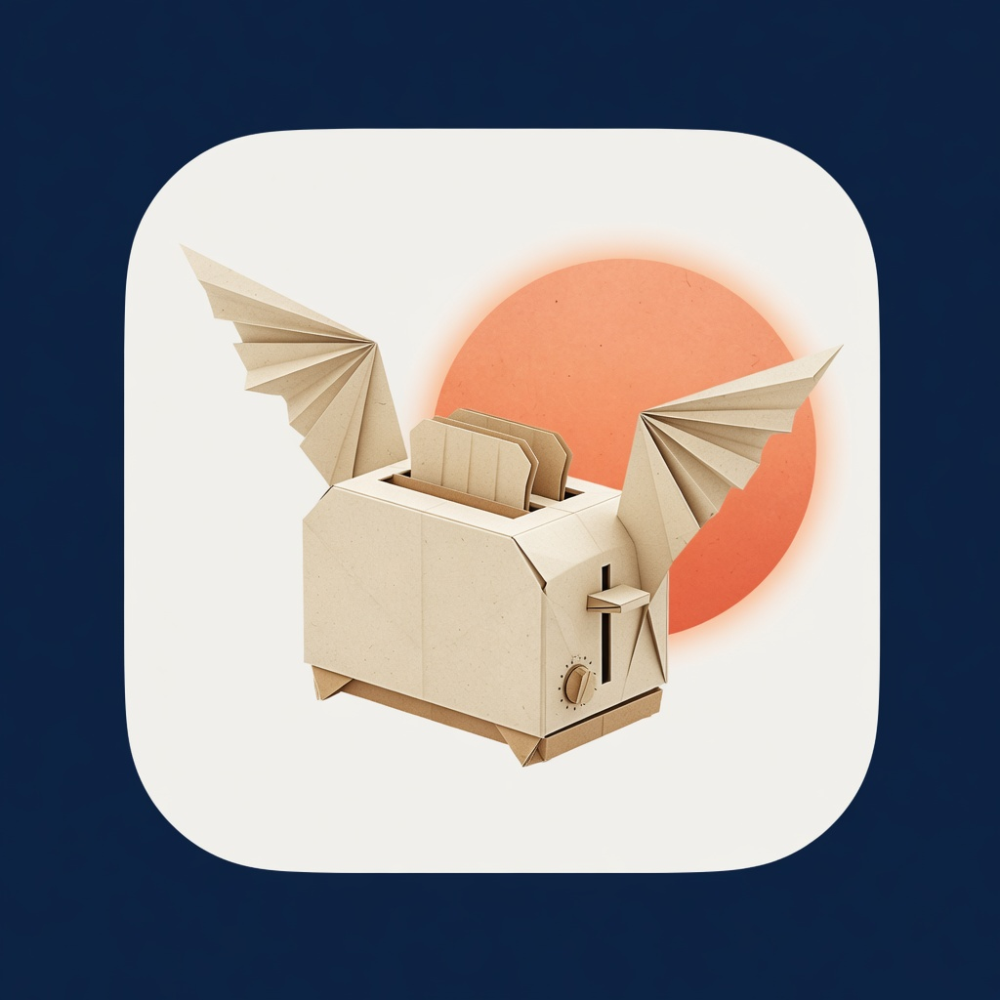
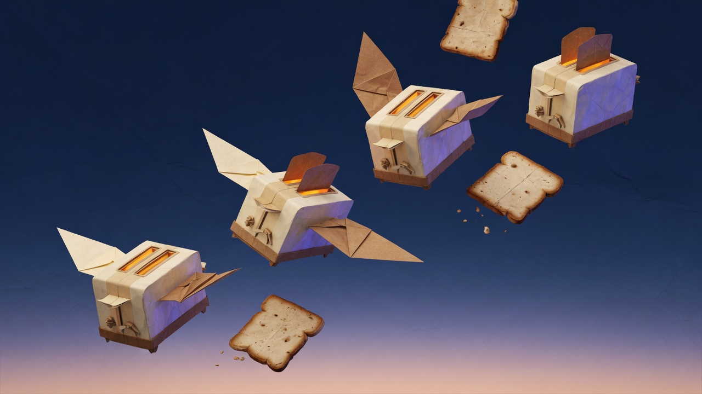

<div align="center">



# Before Light

**Classic-style screensavers for Omarchy 4.**

A bar picker, fullscreen preview, per-saver settings, and an idle hook.
Original engine and pixel art. Not affiliated with Berkeley Systems,
Infinisys, or After Dark.


<br><br>



</div>

## Install

```bash
omarchy plugin add https://github.com/flynnsbit/omarchy-beforelight.git --enable --yes
```

Click the Before Light icon on the bar. If enable did not place it:

```bash
omarchy bar add beforelight --section right
```

No network after install, no sudo. Setup **compiles savers from `engine/`** on
this machine (`gcc`, `make`, `sdl2-config`). Omarchy already has those. No
prebuilt ELF binaries are shipped or installed.

## What it does

| | |
|---|---|
| **Picker** | Click the bar icon. The ON row is the idle screensaver. |
| **Preview** | Play on the selected row. Move the mouse to dismiss. |
| **Settings** | Cog on savers that have knobs. Hidden when they don't. |
| **Idle** | Uses the ON saver. The SDL window is a topmost overlay, so the Omarchy bar stays running underneath. |
| **Stock TTE** | You can still pick Omarchy's packaged terminal screensaver. |

## Savers

| | |
|---|---|
| **Paper Toasters** | Origami-winged toasters on the breeze |
| **Aquarium** | Pixel fish in a home tank |
| **Globe** | Earth spinning in space |
| **Spotlight** | City night with a moving beam |
| **Starry Night** | Starfield over a city silhouette |
| **Code Rain** | Falling green code |
| **Warp, Worms, Bounce, Fade, Hard Rain, Rainstorm, Paper Fire, Life Forms, Logo, Messages, Randomizer** | Also in the list |

## Keys in the picker

| | |
|---|---|
| `↑` `↓` | move between savers |
| `Enter` | turn the focused saver ON |
| `P` | preview the ON saver |
| `Esc` | close |

## How it works

**Idle.** A drop-in `omarchy-screensaver` wrapper sits on `PATH` ahead of the packaged TTE binary, so Omarchy's existing idle timer launches Before Light when it is selected.

**Covering the desktop.** The saver is a wlr-layer-shell Overlay. The Omarchy bar is not hidden or restored.

**Settings.** Stored in `~/.config/omarchy/beforelight.json`. Changes apply on the next preview or idle.

## Build

Savers are C + SDL2 in `engine/`. Plugin enable runs `make` into
`~/.cache/beforelight` and copies the results into
`~/.config/omarchy/branding/screensaver`. To compile yourself:

```bash
make -C engine
```

Build depends on `gcc`, `sdl2-config`, SDL2_image, SDL2_ttf, SDL2_mixer, and
(for the overlay shim) `wayland-scanner` plus SDL3.

## Remove

```bash
omarchy-beforelight-uninstall
```

That unloads the plugin and removes the wrapper, overlay shim, compiled savers,
Hyprland snippet, cache, and config. First enable shows a notification while
savers compile.

## License

MIT.
